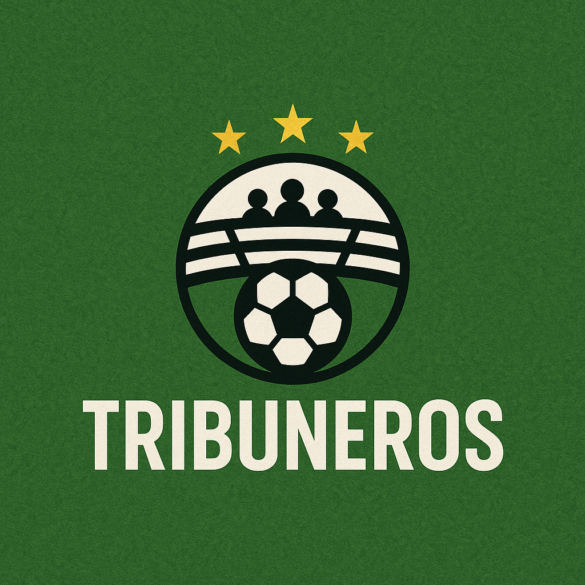

<p align="center">
  
</p>

<p align="center">
  
  
  
  
  
  
  
</p>

# Tribuneros - La red social del fútbol

**Tribuneros** es una aplicación web construida con **Next.js 15 y Supabase** que propone una nueva forma de interactuar con el fútbol. Inspirada en plataformas como Letterboxd, permite a los usuarios registrar, puntuar y comentar los partidos que ven, ya sea en vivo o por televisión. Además, ofrece funciones sociales como favoritos, opiniones públicas, estadísticas personales y más.

---

## 🗂️ Información general

| Atributo               | Detalle                                           |
|------------------------|----------------------------------------------------|
| Nombre del Proyecto    | Tribuneros                                         |
| Tipo                   | Plataforma Web / Social Deportiva                  |
| Tecnologías            | Next.js, Supabase, PostgreSQL, TailwindCSS         |
| Lenguaje               | TypeScript                                         |
| Autenticación          | Supabase Auth (Google, Twitter)                   |
| Base de Datos          | PostgreSQL (Supabase)                             |
| Hosting                | Vercel                                             |
| Licencia               | MIT                                                |
| Estado del proyecto    | En desarrollo                                      |
| Última actualización   | Julio 2025                                         |
| Autor                  | Tobias Orban - tobiasorban00@gmail.com            |

---

## 🧩 Descripción funcional

Tribuneros permite:

- Consultar los **partidos del día**, obtenidos desde una API externa.
- Registrar si se vio un partido (en TV o en la cancha).
- Puntuar los partidos del 1 al 5.
- Escribir y leer opiniones públicas.
- Marcar partidos como favoritos.
- Acceder a un perfil con:
  - Historial de partidos vistos.
  - Opiniones propias.
  - Favoritos guardados.
  - Equipos seguidos (en desarrollo).
  - Estadísticas personales.

---

## 🧠 Funcionalidades clave

### Partidos

- Sincronización diaria con la API de fútbol.
- Vista de partidos destacados (selección curada).
- Puntuación de partidos con promedio general.
- Opiniones públicas asociadas.
- Marcado de visualización (TV / Estadio).
- Recordatorios de inicio (planeado).

### Perfil del Usuario

- Historial completo.
- Opiniones escritas.
- Lista de favoritos.
- Equipos seguidos (en desarrollo).
- Métricas y estadísticas propias.

---

## 🛠️ Backend y Base de Datos

**Supabase + PostgreSQL** con RLS habilitado para máxima seguridad.

**Tablas principales:**

- `matches` → Partidos sincronizados
- `match_ratings` → Puntuaciones de usuarios
- `match_opinions` → Opiniones escritas
- `favorites` → Favoritos por usuario
- `views` → Visualizaciones (TV o estadio)
- `user_profiles` → Datos extendidos del usuario
- `teams`, `leagues` → Información de equipos y ligas

La lógica se gestiona desde `lib/database-service.ts`.

---

## 🔐 Seguridad

- Row Level Security (RLS) activo.
- Funciones personalizadas con `SECURITY DEFINER` y `SET search_path`.
- Acceso controlado por rol (`service_role`, `admin`, `auth.uid()`).

---

## 🧱 Estructura del Proyecto

```bash
/app
├── page.tsx
├── partidos/
│   ├── hoy/
│   └── destacados/
├── profile/
│   ├── favorites/
│   ├── opiniones/
│   └── partidos-vistos/

/components
├── MatchCard.tsx
├── StarRating.tsx
├── OpinionForm.tsx
├── Navbar.tsx
├── Footer.tsx

/lib
├── supabase.ts
├── auth.ts
└── database-service.ts

/public
└── assets/
```

---

## 🚀 Instalación

```bash
# Clonar repositorio
git clone https://github.com/tu-usuario/tribuneros.git
cd tribuneros

# Instalar dependencias
npm install

# Configurar entorno
NEXT_PUBLIC_SUPABASE_URL=https://<your-url>.supabase.co
NEXT_PUBLIC_SUPABASE_ANON_KEY=ey...

# Ejecutar en desarrollo
npm run dev
```

---

## 🧪 Testeo sin API

1. Insertar manualmente partidos en `matches`.
2. Probar puntuar, comentar, ver y guardar favoritos.
3. Validar comportamiento completo desde el perfil.

---

## 🧰 Tecnologías utilizadas

| Tecnología | Descripción |
|-----------|-------------|
|  | Framework de React usado para construir toda la aplicación web. Permite el rendering híbrido (SSR/SSG), rutas por archivos, manejo de API Routes y excelente performance. |
|  | Plataforma Backend as a Service (BaaS) usada como backend principal: proporciona base de datos, autenticación, funciones y RLS. |
|  | Motor de base de datos relacional utilizado para almacenar partidos, usuarios, opiniones, puntuaciones y más. Gestionado automáticamente por Supabase. |
|  | Framework CSS utility-first para diseñar de forma rápida y moderna toda la interfaz de usuario. |
|  | Superset de JavaScript que añade tipado estático. Mejora la mantenibilidad y escalabilidad del código en el proyecto. |
|  | Plataforma usada para el despliegue automático de la app. Cada push en GitHub actualiza automáticamente la versión online. |

---


## 📅 Roadmap

- [ ] Notificaciones “Recordame este partido”
- [ ] Equipos favoritos
- [ ] Buscador de partidos
- [ ] Panel de administración
- [ ] Feed de actividad social
- [ ] Insignias y estadísticas avanzadas
- [ ] PWA Mobile

---

## 🤝 Contribuciones

1. Hacé un fork.
2. Cloná tu fork localmente.
3. Creá una rama: `git checkout -b feature-nombre`.
4. Subí los cambios.
5. Hacé un PR.

---

## 👤 Autor

**Tobias Orban**  
📧 tobiasorban00@gmail.com  
🐦 [@tobiager](https://twitter.com/tobiager)  
🎓 Estudiante de Licenciatura en Sistemas - UNNE  
⚽ Apasionado por el fútbol, el desarrollo y la comunidad digital.

<p align="center"><b>❤️🐔 Hecho con pasión y dedicación por Tobias</b></p>
